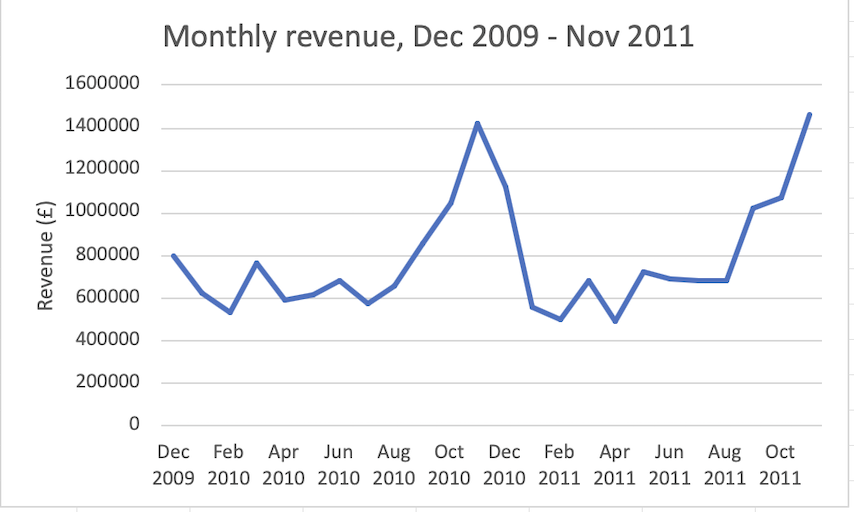

# Online Retail Sales Analysis

Analysis of ~1.07M transactions from a UK-based online gift retailer
(Dec 2009 – Dec 2011), using PostgreSQL.

**Status:** in progress — data loaded and verified, analysis underway.

## Source
Chen, D. (2012). Online Retail II [Dataset]. UCI Machine Learning Repository.
https://doi.org/10.24432/C5CG6D — licensed CC BY 4.0.

## Questions
1. How did revenue trend over the two years?
2. Which products drive revenue, and does that differ from unit volume?
3. How concentrated is revenue by country?
4. What is average order value, and how does it vary by market?
5. What share of customers are repeat buyers, and what revenue do they drive?
6. How much revenue is lost to returns?

## Approach
- Source data ships as a two-sheet `.xlsx`. `convert.py` combines both sheets
  into a single CSV — exporting one sheet from Excel silently drops ~half the rows.
- Loaded into PostgreSQL via `\copy` after defining the schema.
- Raw data kept unmodified in `retail_raw`; cleaning will happen in a separate table.

## Data quality

### Load verification
- **Row count:** 1,067,371 rows loaded, matching the source file exactly.
- **Missing customer IDs:** 243,007 rows (22.8%) have no customer ID. These are
  usable for revenue and product analysis but not for customer-level questions,
  so question 5 runs on a smaller population than questions 1–4 and 6.
- **Country field:** 43 distinct values; some may not be countries.

Queries in `sql/03_verification.sql`.

### Cleaning decisions
Applied in `sql/05_cleaning.sql` to build `retail_clean` from `retail_raw`,
which is left unmodified. Full investigation and reasoning in
`notes/data_quality_investigation.md`.

- **Non-product stock codes excluded.** Postage and carriage (`POST`, `DOT`,
  `C2`, `C3`), fees (`BANK CHARGES`, `AMAZONFEE`, `CRUK`), adjustments
  (`ADJUST`, `ADJUST2`, `M`, `m`, `B`), discounts (`D`), samples (`S`) and
  test entries (`TEST001`, `TEST002`). Left in, postage in particular would
  appear in a top-products ranking.
- **Gift vouchers excluded.** Stock codes `gift_0001_10` to `gift_0001_90` are
  voucher sales, not product sales. Revenue from a voucher arguably occurs on
  redemption rather than purchase, and if redemptions also appear in this
  table, counting both would double-count.
- **Bad debt write-offs excluded.** 5 rows totalling −£158,676, all stock code
  `B`, on invoices prefixed `A` — a third invoice prefix alongside normal
  sales and `C` cancellations. A real business event, but not sales.
- **Zero-price rows excluded.** 6,202 rows (0.58%), spread across 473 days
  with no concentration, 6,131 of them with no customer ID. Routine
  back-office corrections rather than sales. They contribute £0 to revenue but
  carry quantities in both directions, which would distort any ranking by
  units sold.
- **Cancellations excluded from sales analysis.** 19,494 rows worth
  −£1,526,668. Analysed separately in question 6, which runs against
  `retail_raw` rather than `retail_clean`.
- **Incomplete final month excluded.** Data ends 2011-12-09, so December 2011
  covers 9 days. Before dropping it I compared daily revenue: £48,187/day over
  those 9 days against £48,725/day in November — a 1% difference. The run rate
  was flat, so the drop in the monthly total is an artifact of the cut-off,
  not a change in the business.
- **Duplicate rows kept.** 34,335 rows (3.2%) are exact duplicates of another
  row across all eight columns. These are ambiguous: they may be system
  artifacts from double-submitted order lines, or legitimate multi-line orders
  where a product was entered several times on one invoice. The data cannot
  distinguish the two, and removing them would understate revenue if they are
  genuine, so they were kept and the ambiguity recorded.

## Key findings

### 1. Revenue is strongly seasonal, peaking in November.**
Both years peak in November — £1.42M in 2010 and £1.46M in 2011 — with the
ramp beginning in September and revenue roughly doubling off a £500–700K
baseline. This is consistent with a wholesale gift retailer shipping stock
to retailers ahead of Christmas. The practical implication is that
month-on-month comparisons are misleading on this data: a January decline
is seasonal, not a downturn. Year-on-year comparison of the same month is
the honest read.

*Dec 2011 excluded because the data ends 09/12/2011. Daily revenue over those 9 days
was £48.2K against £48.7K in November, so the run rate was flat and the
apparent collapse is an artifact of the cut-off, not a change in the business.*

## Repo
- `sql/` — queries, numbered in execution order
- `convert.py` — xlsx → CSV conversion
- `outputs/` — charts and exported results

Raw data files are not committed. Download from the source above and run
`convert.py` to reproduce.
