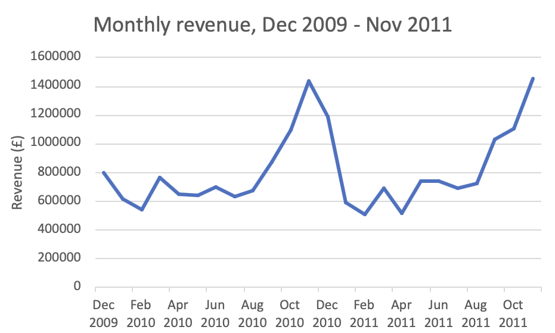
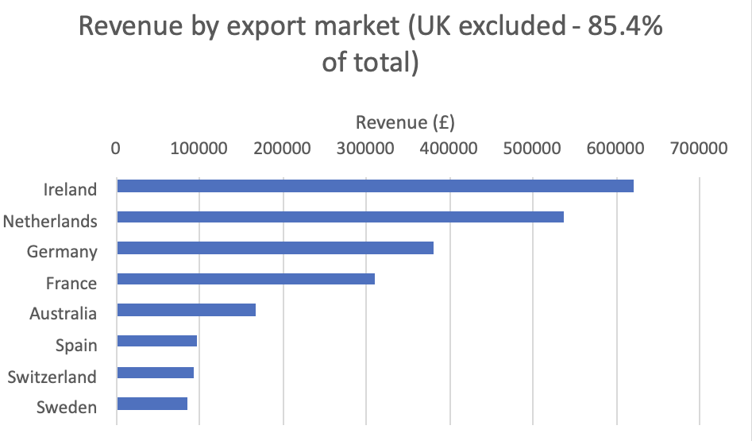

# Online Retail Sales Analysis

Analysis of ~1.07M transactions from a UK-based online gift retailer
(Dec 2009 – Dec 2011), using PostgreSQL. The business is a wholesaler: revenue 
peaks every November, the average order carries 26 product lines,
and 96.6% of identified revenue comes from repeat customers.

## Source
Chen, D. (2012). Online Retail II [Dataset]. UCI Machine Learning Repository.
https://doi.org/10.24432/C5CG6D — licensed CC BY 4.0.

## Questions
1. How did revenue trend over the two years?
2. Which products drive revenue, and does that differ from unit volume?
3. How concentrated is revenue by country?
4. What is average order value, and how does it vary by market?
5. What share of customers are repeat buyers, and what revenue do they drive?
6. How much revenue is lost to returns?

## Approach
- Source data ships as a two-sheet `.xlsx`. `convert.py` combines both sheets
  into a single CSV — exporting one sheet from Excel silently drops ~half the rows.
- Loaded into PostgreSQL via `\copy` after defining the schema.
- Raw data kept unmodified in `retail_raw`; `retail_clean` is built from it by
  `sql/05_cleaning.sql`, which is re-runnable from scratch.

## Data quality

### Load verification
- **Row count:** 1,067,371 rows loaded, matching the source file exactly.
- **Missing customer IDs:** 243,007 rows (22.8%) have no customer ID. These are
  usable for revenue and product analysis but not for customer-level questions,
  so question 5 runs on a smaller population than questions 1–4 and 6.
- **Country field:** 43 distinct values; some may not be countries (examined in finding 3).

Queries in `sql/03_verification.sql`.

### Cleaning decisions
Applied in `sql/05_cleaning.sql` to build `retail_clean` from `retail_raw`,
which is left unmodified. Full investigation and reasoning in
`notes/data_quality_investigation.md`.

- **Non-product stock codes excluded.** Postage and carriage (`POST`, `DOT`,
  `C2`, `C3`), fees (`BANK CHARGES`, `AMAZONFEE`, `CRUK`), adjustments
  (`ADJUST`, `ADJUST2`, `M`, `m`, `B`), discounts (`D`), samples (`S`) and
  test entries (`TEST001`, `TEST002`). Left in, postage in particular would
  appear in a top-products ranking.
- **Gift vouchers excluded.** Stock codes `gift_0001_10` to `gift_0001_90` are
  voucher sales, not product sales. Revenue from a voucher arguably occurs on
  redemption rather than purchase, and if redemptions also appear in this
  table, counting both would double-count.
- **Bad debt write-offs excluded.** 5 rows totalling −£158,676, all stock code
  `B`, on invoices prefixed `A` — a third invoice prefix alongside normal
  sales and `C` cancellations. A real business event, but not sales.
- **Zero-price rows excluded.** 6,202 rows (0.58%), spread across 473 days
  with no concentration, 6,131 of them with no customer ID. Routine
  back-office corrections rather than sales. They contribute £0 to revenue but
  carry quantities in both directions, which would distort any ranking by
  units sold.
- **Cancellations excluded from sales analysis.** 19,494 rows worth
  −£1,526,668. Analysed separately in question 6, which runs against
  `retail_raw` rather than `retail_clean`.
- **Incomplete final month excluded.** Data ends 2011-12-09, so December 2011
  covers 9 days. Before dropping it I compared daily revenue: £48,187/day over
  those 9 days against £48,725/day in November — a 1% difference. The run rate
  was flat, so the drop in the monthly total is an artifact of the cut-off,
  not a change in the business.
- **Duplicate rows kept.** 34,335 rows (3.2%) are exact duplicates of another
  row across all eight columns. These are ambiguous: they may be system
  artifacts from double-submitted order lines, or legitimate multi-line orders
  where a product was entered several times on one invoice. The data cannot
  distinguish the two, and removing them would understate revenue if they are
  genuine, so they were kept and the ambiguity recorded.
- **One phantom order excluded.** Invoice 541431 (74,215 ceramic storage jars,
  2011-01-18 10:01) was cancelled 16 minutes later by C541433. An order-entry
  error rather than a sale. Left in, it would have been the top product by
  units sold and inflated revenue by £77,184. Found while investigating an
  outlier in the returns analysis, not during the initial cleaning pass.

**Result:** 1,067,371 rows in `retail_raw`, 1,011,989 in `retail_clean` —
55,382 rows removed (5.2%). Gross product revenue: £19,417,504.15.

**Known limitation:** `retail_clean` removes cancellation rows but does not
remove the original orders they cancel. The one large case above was caught
because it distorted a ranking; smaller cancelled orders remain. Fixing this
properly means matching every cancellation to its original invoice.

## Key findings

### 1. Revenue is strongly seasonal, peaking in November
Both years peak in November — £1,435,680 in 2010 and £1,457,746 in 2011 —
with the ramp beginning in September. Off-season months sit between £509K
and £764K, so the peak runs 2.2x the January–August average and 2.9x the
February trough. This is consistent with a wholesale gift retailer shipping
stock to retailers ahead of Christmas.

The data holds two complete comparable 12-month periods: Dec 2009–Nov 2010
at £9.43M against Dec 2010–Nov 2011 at £9.99M, **growth of 5.9%**. That
comparison is only meaningful because both windows contain exactly one
Christmas season — comparing calendar years would have put one peak against
none.

The practical implication is that month-on-month comparison is misleading
here: a January decline is seasonal, not a downturn.

### 2. Revenue and volume are driven by two different product populations
Only four products appear in both the revenue and units top tens. The two
leaders are opposites: WW2 Gliders sell 108,771 units — more than any other
product — but generate just £24,881 at £0.23 each, placing them **151st by
revenue despite being first by volume**. The Regency Cakestand earns 13.6x
that revenue (£338,556) on a quarter of the volume, at £12.48 per unit.

Median unit price is £0.64 among the volume leaders and £2.74 among the
revenue leaders. Ranking products by either measure alone would misrepresent
the business: the volume list is cheap party and impulse goods, the revenue
list is higher-priced statement pieces.

*Method note: grouped by `stock_code` rather than description, because the
same code appears with inconsistent descriptions — `21212` is recorded as both
"PACK OF 72 RETROSPOT CAKE CASES" and "PACK OF 72 RETRO SPOT CAKE CASES".
Grouping by description splits that product across two rows, moving it from
2nd to 9th and 10th by units and understating another product's revenue by
£34,631.*

### 3. Revenue is overwhelmingly domestic — the UK is 85% of it
The United Kingdom accounts for £16,584,435, or 85.41% of product revenue.
The next four markets — Ireland, the Netherlands, Germany and France — bring
the top five to 94.95%. The remaining 38 markets together account for 5.05%,
and all but five sit below 1% individually.

This is a UK business with a thin European export tail rather than an
international one, and it sets a limit on what the rest of the analysis can
claim: outside the top five markets, per-market samples are small enough that
comparing metrics across all 43 would be reading noise rather than signal.

*Two entries in the country field are not countries — "Unspecified" (£10,936)
and "European Community" (£1,159). Combined they are 0.062% of revenue, so
excluding them changes no figure above to two decimal places and they were
left in. The field is also inconsistently named (EIRE for Ireland, RSA for
South Africa, Channel Islands as a crown dependency), though no market is
duplicated, so totals are unaffected.*

### 4. The typical order is £300, not £500 — and export orders are twice the size of domestic ones

Average order value across 38,699 orders is £501.76, but the median order is
**£303.30**. The mean sits 65% above the typical order because a minority of
very large wholesale orders pull it up — the range runs from £0.19 to
£52,940.94. Quoting AOV alone would overstate what a typical customer spends
by two thirds.

Order size also splits sharply by geography. The UK accounts for 85.4% of
revenue but 91.6% of orders, so its average order is **£467.97** — below the
overall figure. Export orders average **£869.04**, 1.86x the UK. The
Netherlands is the extreme case at £2,526.88 per order, 5.4x the UK, across
only 213 orders.

A plausible explanation is that cross-border shipping costs make small
international orders uneconomic, so only larger consignments travel. This
dataset cannot confirm that — it holds no shipping or customer-type
information — but it is the obvious candidate and would be the first thing to
test with additional data.

*An order is defined as a distinct invoice, not a row: the table holds one row
per line item, so dividing revenue by row count would give the average line
item rather than the average order. Eleven markets have three orders or fewer,
where the "average" is one or two transactions — those rows are reported with
their order counts rather than compared against markets with meaningful volume.*

### 5. A repeat customer is worth eleven times a one-time one

Of 5,824 identified customers, 71.7% ordered more than once — and they
account for **96.6% of revenue**. The 28.3% who never came back contributed
3.4%. Per customer that is **£3,895 against £348, a ratio of 11.2x**.

For a wholesaler this shape is expected; the magnitude is the finding. At
that ratio, retaining an existing customer is worth more than acquiring a
new one at almost any plausible cost comparison, and the single most
valuable thing the business could measure next is why 1,647 customers
ordered once and never returned.

*Population note: this is the only question that runs on a subset. 243,007
rows have no customer ID and cannot be attributed to a person, so the
analysis covers identified customers only. Those customers represent
£16,844,051 — 86.7% of total revenue — so while 22.8% of rows are excluded,
only 13.3% of revenue is. The bias runs the other way too: customers with
IDs are account holders and likely more loyal than walk-up buyers, so 71.7%
probably overstates the true repeat rate across all purchasers.*

### 6. Returns are 2.45% of revenue — the headline figure misleads twice over
Cancellation rows total £1.53M, which would suggest a return rate near 8%.
Two corrections bring that down. First, two thirds of that value is accounting
reversal rather than goods coming back: manual adjustments (£423,107) and
Amazon fees (£265,350) dominate, alongside bank charges, postage and
discounts. Second, a single transaction — 74,215 ceramic storage jars ordered
and cancelled sixteen minutes later — accounted for 14% of what remained, and
was an order-entry error rather than a return.

On a like-for-like basis, genuine product returns are **£475,246 against
£19,417,504 of product revenue — 2.45%**. Taking the raw cancellation total
would have overstated the rate by more than three times.

*Method: returns measured against `retail_raw`, since `retail_clean` excludes
cancellation rows. Both sides of the calculation apply the same exclusions.
Full investigation in `notes/data_quality_investigation.md`.*

## Planned
Cohort retention analysis — monthly cohorts by first purchase, tracked
forward. Requires window functions.

## Repo
- `sql/` — queries, numbered in execution order
- `notes/` — data quality investigation and decisions
- `outputs/` — charts and exported results
- `convert.py` — xlsx → CSV conversion

Raw data files are not committed. Download from the source above and run
`convert.py` to reproduce.
